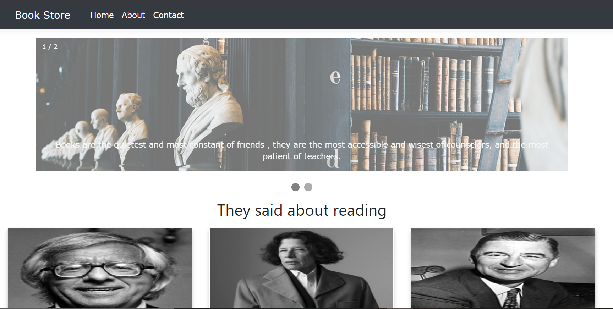
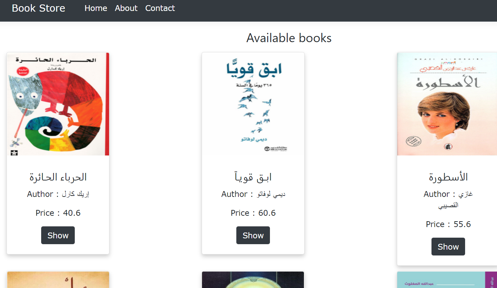
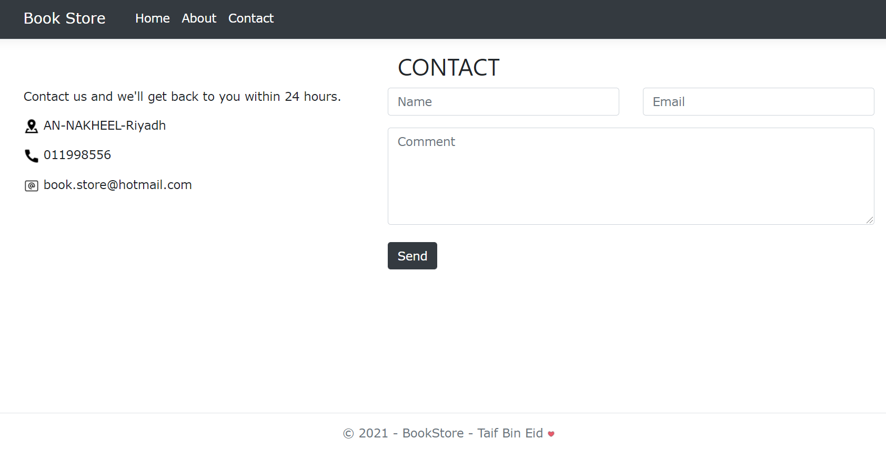

# Project01_ASP.NET_MVC
## Book store 

This simple website shows us a collection of books, and we can contact with the store and learn more about the details of the books.

 

> Home page 

 

> Available books 

 

> Contact page 

# features
* Web app MVC
* Bootstrap

