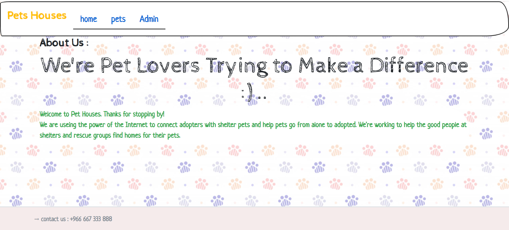

# Project01_ASP.NET_MVC

فكرة المشروع

موقع متكامل على حسب اختيارك باستخدام ASP.NET MVC على سبيل المثال: مكتبة إلكترونية، تسوق إلكتروني… 

متطلبات المشروع

باستخدام المفاهيم الأساسية لـMVC قم بإنشاء تطبيق ASP.NET MVC يحتوي على التالي:

- على الأقل 2 من الـControllers 
- على الأقل 2 من الـModels
- على الأقل 3 من الـViews
- إضافة Bootstrap

admin accounts should be one of the these :
"email : taghreed@gmail.com
password : 112233"
"email : battal@gmail.com
password :112233"

المتدربة :تغريد القحطاني

المشرفة : نورة محسن

المجموعة : مجموعة نيوم 
