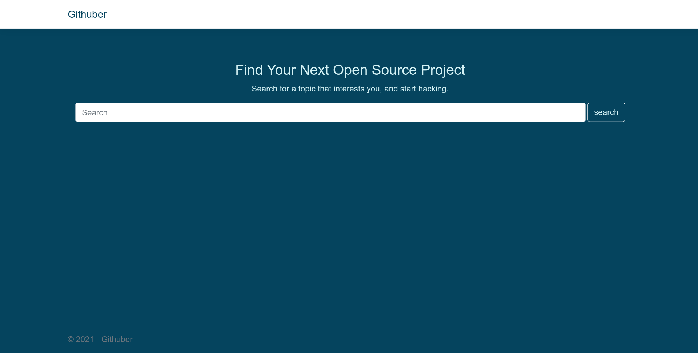
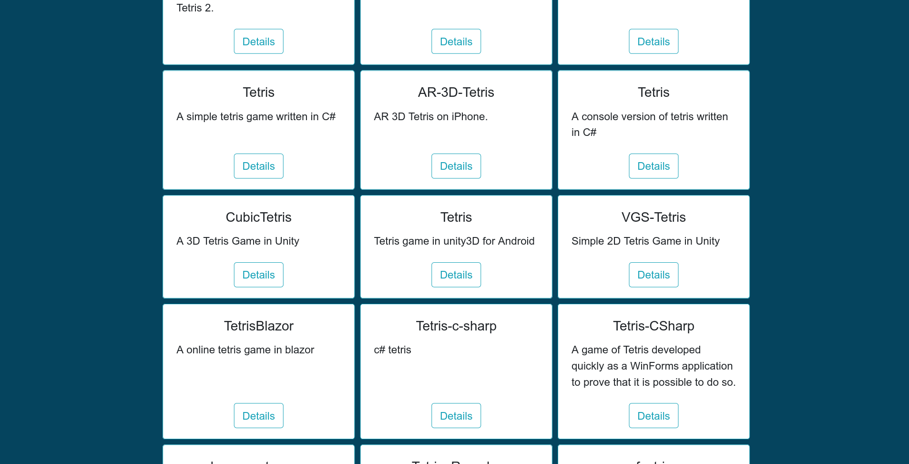
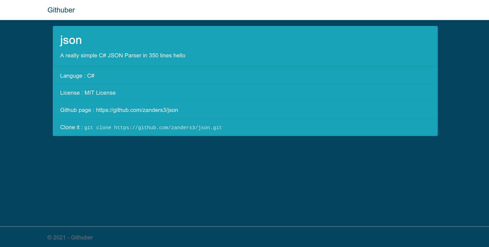

# Githuber

محرك بحث للمشاريع مفتوحة المصدر على منصة Github المبنية بلغة C#

## التقنيات المستخدمة في المشروع

- ASP.NET
- REST API ( Github api)
  
## Screenshots

#

### **اسم المتدرب : عبدالعزيز الاسمري**

### **اسم المشرفة: غادة المطيري**

### **اسم المجموعة: السودة**
 

