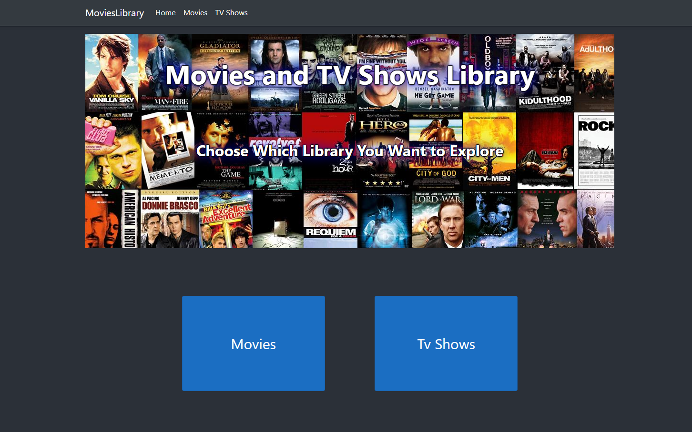
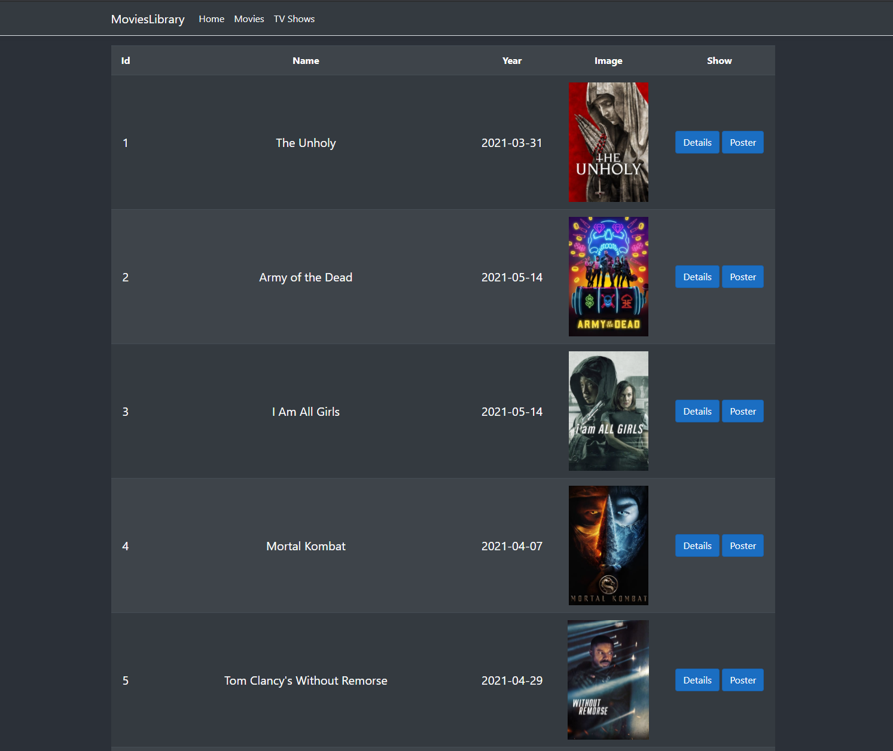
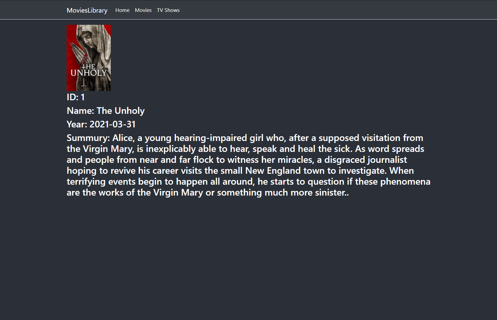
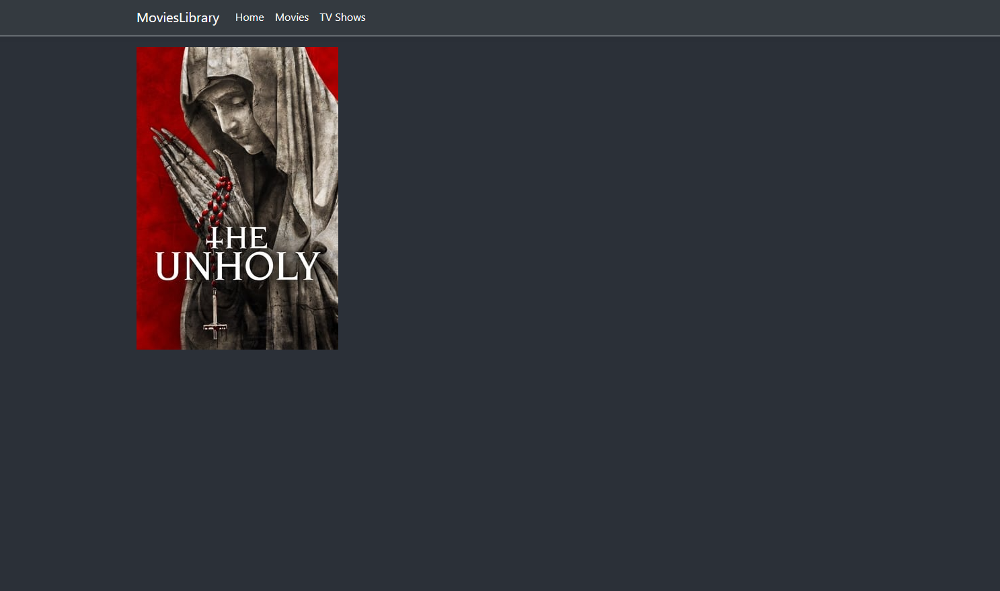

# Project01_ASP.NET_MVC

<h1>Movies and TV Shows Library</h1>

فكرة المشروع

موقع متكامل على حسب اختيارك باستخدام ASP.NET MVC على سبيل المثال: مكتبة إلكترونية، تسوق إلكتروني… 

متطلبات المشروع

باستخدام المفاهيم الأساسية لـMVC قم بإنشاء تطبيق ASP.NET MVC يحتوي على التالي:

- على الأقل 2 من الـControllers 
- على الأقل 2 من الـModels
- على الأقل 3 من الـViews
- إضافة Bootstrap

جزء Bonus

- عمل API
- عمل علاقات Relations بين الـModels باستخدام EntityFramework
